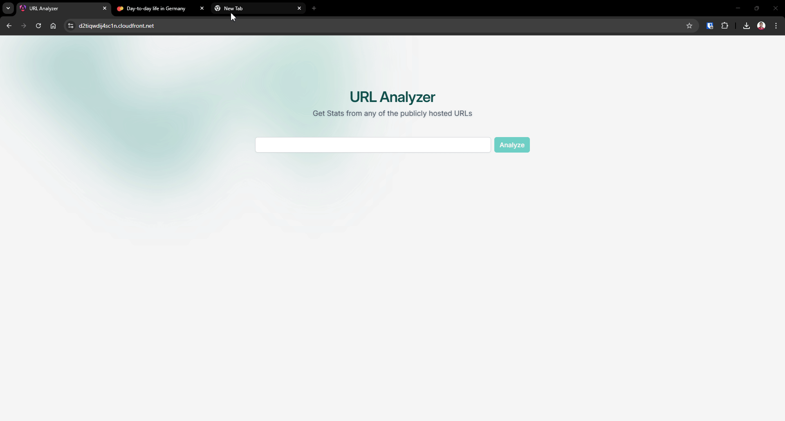
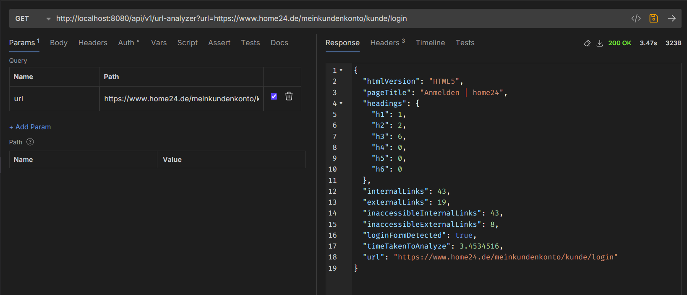
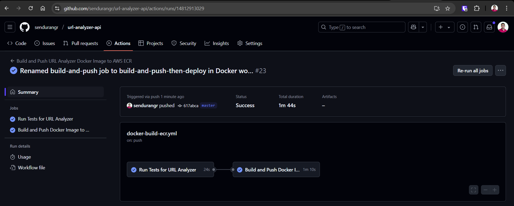
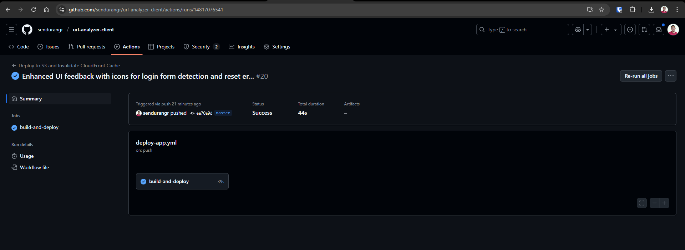
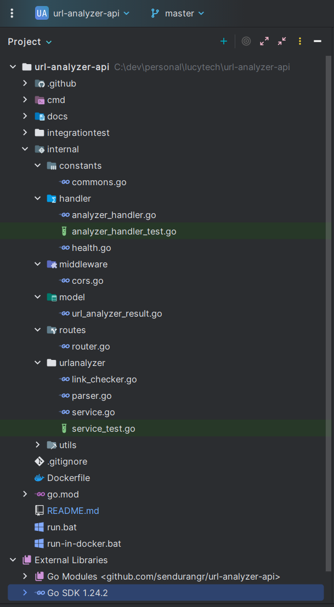

# URL Analyzer - Backend

<!-- TOC -->
* [URL Analyzer - Backend](#url-analyzer---backend)
  * [🚀 Access Url Analyzer Web App here : <br> https://d2tiqwdij4sc1n.cloudfront.net](#-access-url-analyzer-web-app-here--br-httpsd2tiqwdij4sc1ncloudfrontnet)
  * [💻 Local Setup Guide](#-local-setup-guide)
    * [Prerequisites](#prerequisites)
    * [Installation](#installation)
  * [👀 Demo](#-demo)
  * [🤙 API Documentation](#-api-documentation)
  * [🪐 Deployment](#-deployment)
    * [✅ CI/CD](#-cicd)
  * [🔅 Linked Repositories - (Frontend, Infrastructure)](#-linked-repositories---frontend-infrastructure)
* [Technical Explanations & Validations](#technical-explanations--validations)
  * [🚀 Dependencies Used](#-dependencies-used)
  * [🧪 Testing [Also in CI/CD]](#-testing-also-in-cicd)
    * [Unit Tests](#unit-tests)
    * [Integration Tests](#integration-tests)
  * [⛔ Do we really need Prometheus in this application? No. Why?](#-do-we-really-need-prometheus-in-this-application-no-why)
  * [⛔ Do we need Rate Limiting in this application? No (under specific assumptions)](#-do-we-need-rate-limiting-in-this-application-no-under-specific-assumptions)
  * [💉 Dependency Injection](#-dependency-injection)
  * [✏️ Logging with `slog`](#-logging-with-slog)
  * [❓ Why I have not deployed to AWS Lambda?](#-why-i-have-not-deployed-to-aws-lambda)
  * [🤯 Challenges faced and the approaches took to overcome](#-challenges-faced-and-the-approaches-took-to-overcome)
  * [💫 Suggestions on possible improvements of the application](#-suggestions-on-possible-improvements-of-the-application)
  * [Screenshots](#screenshots)
    * [Backend Pipeline](#backend-pipeline-)
    * [Frontend Pipeline](#frontend-pipeline)
    * [Project Structure](#project-structure)
<!-- TOC -->

## 🚀 Access Url Analyzer Web App here : <br> https://d2tiqwdij4sc1n.cloudfront.net

## 💻 Local Setup Guide

### Prerequisites

- Go 1.20 or later (go 1.24.x)

### Installation

1. Clone the repository:
   ```bash
   git clone https://github.com/sendurangr/url-analyzer-api
   cd url-analyzer-api
    ```

2. Install dependencies:
   ```bash
   go mod download
   ```

3. Start the server:
   ```bash
   go run ./cmd/server/main.go
   ```

4. The server will start on `localhost:8080` by default.
   Health Check endpoint is available at `http://localhost:8080/health`

---

## 👀 Demo

**Demo - 1**


**Demo - 2**



---

## 🤙 API Documentation

- The URL Analyze api is available at `http://localhost:8080/api/v1/url-analyzer?url=<your-url>`.

```bash
curl --request GET \
  --url 'http://localhost:8080/api/v1/url-analyzer?url=https%3A%2F%2Fwww.home24.de%2F'
```




---

## 🪐 Deployment

| Services | Endpoints                                             |
|----------|-------------------------------------------------------|
| Frontend | https://d2tiqwdij4sc1n.cloudfront.net                 |
| Backend  | https://8pmmtnd3yw.ap-south-1.awsapprunner.com/health |


### ✅ CI/CD

- The **CI/CD** pipeline is set up using **GitHub Actions**.
- The pipeline is triggered on every push to the `master` branch.
- The pipeline builds the Docker image and deploys it to AWS App Runner through <br>
  `GitHub Actions -> AWS ECR -> AWS App Runner`.

## 🔅 Linked Repositories - (Frontend, Infrastructure)

| Services                           | Repositories                                                                                    |
|------------------------------------|-------------------------------------------------------------------------------------------------|
| 🔗 Backend - Golang                | https://github.com/sendurangr/url-analyzer-api    (Current)                                     |
| 🔗 Deployment Infrastructure - AWS | https://github.com/sendurangr/url-analyzer-infrastructure <br> (Provisioning through Terraform) |
| 🔗 Frontend - Angular              | https://github.com/sendurangr/url-analyzer-client                                               |

# Technical Explanations & Validations

## 🚀 Dependencies Used

- `github.com/gin-gonic/gin`
- `github.com/gin-contrib/cors`
- `golang.org/x/net`

## 🧪 Testing [Also in CI/CD]

⚠️ I have not used any external testing libraries like `testify` or `ginkgo` for testing. <br>
I have used the built-in `testing` package for unit and integration tests. <br>
Reasons: built-in testing package is simple and was easy to use for this project. <br>

### Unit Tests

- The project is tested using `go test ./... -cover` command.
- expected output

```bash
PS C:\dev\personal\lucytech\url-analyzer-api> go test ./... -cover
        github.com/sendurangr/url-analyzer-api/cmd/server               coverage: 0.0% of statements
ok      github.com/sendurangr/url-analyzer-api/integrationtest  2.311s  coverage: [no statements]
?       github.com/sendurangr/url-analyzer-api/internal/constants       [no test files]
ok      github.com/sendurangr/url-analyzer-api/internal/handler 0.770s  coverage: 88.2% of statements
        github.com/sendurangr/url-analyzer-api/internal/middleware              coverage: 0.0% of statements
?       github.com/sendurangr/url-analyzer-api/internal/model   [no test files]
        github.com/sendurangr/url-analyzer-api/internal/routes          coverage: 0.0% of statements
ok      github.com/sendurangr/url-analyzer-api/internal/urlanalyzer     1.912s  coverage: 89.8% of statements
        github.com/sendurangr/url-analyzer-api/internal/utils           coverage: 0.0% of statements

```

### Integration Tests

- The integration tests are located in the `integrationtest` package.
- The tests are run using the `go test ./...` command.

---

## ⛔ Do we really need Prometheus in this application? No. Why?

- The application is deployed in AWS App Runner, which integrates directly with **Amazon CloudWatch** for built-in
  metrics, logs, and alarms.
- App Runner **automatically scales** instances up/down based on traffic, and these instances are **ephemeral and
  managed** — we don’t get fixed IPs or persistent infrastructure.
- Since we don't have access to individual instance details (like static IPs or ports), setting up **Prometheus node
  exporters or service discovery** is not straightforward.
- Using **Prometheus** in this case adds unnecessary complexity when **CloudWatch provides sufficient observability**
  for most use cases (e.g., CPU, memory, request count, error rates).

---

## ⛔ Do we need Rate Limiting in this application? No (under specific assumptions)

- The application is deployed in AWS App Runner, which automatically scales based on CPU and memory thresholds.
- App Runner will spin up instances and balance load accordingly.
- ❗ However, if we need to protect against abusive clients, reduce cost, or safeguard downstream systems,
  then implementing rate limiting at the application level or using AWS WAF or API Gateway is recommended.

---

## 💉 Dependency Injection
- The application uses **Dependency Injection** to manage dependencies and improve testability.

## ✏️ Logging with `slog`

- The application uses the `slog` package from the Go standard library for structured logging.
- `slog` is preferred over third-party libraries like `logrus` because:
    - It is **officially supported** and part of the standard library (from Go 1.21).
    - It offers **structured logging** with support for **JSON output**, levels, and attributes.
    - It generally provides **better performance** and **integration** compared to older logging libraries like
      `logrus`.

---

## ❓ Why I have not deployed to AWS Lambda?

- AWS Lambda **can be a good fit** for this kind of lightweight, stateless application, But it comes with additional
  setup complexity when testing locally.
- For effective local testing, you'd need to configure tools like **AWS SAM**, **LocalStack**, or Docker-based
  emulation.
- Otherwise, lambda is a good fit for this application.

---

## 🤯 Challenges faced and the approaches took to overcome

- **Don't know Golang** - This is the first time I am doing Golang. Therefore, I had to learn the language and its
  idioms
  before doing this project.
- **Goroutines, Channels, Context** - I had to learn how to use goroutines, channels, and context in Golang.
  <br> I used goroutines to make the URL analysis concurrent and channels to communicate between the goroutines. I used
  context to manage the lifecycle of the goroutines and to cancel them if needed.
- **Go Testing Best Practices**
    - Table driven tests: I used table-driven tests to test the URL analysis function with different inputs and expected
      outputs. Used Ref : https://go.dev/wiki/TableDrivenTests
    - Followed : Don't test private methods or internal structures unless absolutely necessary. Test the exported
      behavior.
- **Controlling Goroutine Concurrency per request by semaphore**: I used a semaphore to limit the number of concurrent
  goroutines per request. This is important to avoid overwhelming the system with too many concurrent requests.
  <br> I used a buffered channel to implement the semaphore. set the value to `64` per request.
- **Speed up dom traversal by checking through switch case** :
  I used switch case to check the type of the node and perform the analysis accordingly. This is faster than using
  if-else statements. switch uses the hash table lookup to find the case that matches the value.
  `n.DataAtom` is an integer value, so it is faster compare than string comparison of using `a.Data`.
    ```bash
    if n.Type == html.ElementNode {
        switch n.DataAtom {
            case atom.Html:
              extractHtmlVersionFromElementNode(n, result)
            case atom.Title:
              extractTitleFromElementNode(n, result)
            ...
        }
    }
    
    ```

---

## 💫 Suggestions on possible improvements of the application

- **Rate Limiting with AWS WAF**
    - Add AWS WAF in front of App Runner using CloudFront or API Gateway.
    - Apply **rate-based rules** to block abusive or excessive requests without needing app-level logic.

- **History of URLs with Authenticated Users**
    - Store the history of URLs analyzed by users.
    - Provide a feature to view previously analyzed URLs.
    - Using MongoDB or DynamoDB for storing the history.

## Screenshots

### Backend Pipeline 




### Frontend Pipeline



### Project Structure
